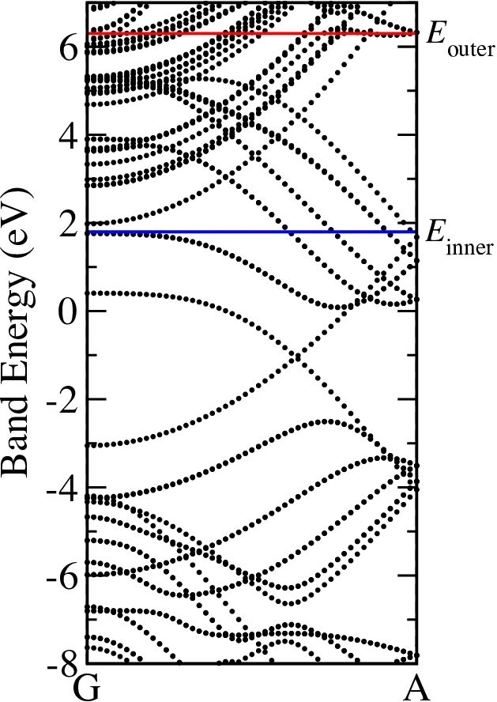

# 13: (5,5) Carbon Nanotube &#151; Transport properties

- Outline: *Obtain the bandstructure, quantum conductance and density
    of states of a metallic (5,5) carbon nanotube*

- Directory: `tutorials/tutorial13/` *Files can be downloaded from [here](https://github.com/wannier-developers/wannier90/tree/develop/tutorials/tutorial13)*

- Input Files

    - `cnt55.scf` *The `pwscf` input file for ground
        state calculation*

    - `cnt55.nscf` *The `pwscf` input file to obtain
        Bloch states for the conduction states*

    - `cnt55.pw2wan` *Input file for `pw2wannier90`*

    - `cnt55.win` *The `wannier90` input file*

In order to form localised WF that describe both the occupied and
unoccupied $\pi$ and $\pi^{\ast}$ manifolds, we use the disentanglement
procedure to extract a smooth manifold of states that has dimension
equal to 2.5 times the number of carbon atoms per unit
cell [@lee-prl05]. The positions of the energy windows are shown in
this [plot](#fig:cnt.win){reference-type="ref" reference="fig:cnt.win"}.

<figure markdown="span" id="fig:cnt.win">
{ width="300" }
<figcaption> Bandstructure of (5,5) carbon nanotube showing the position
of the outer and inner energy windows.</figcaption>
</figure>

The part of the `wannier90` input file that controls the transport part
of the calculation looks like:

```vi title="Input file"
transport = true
transport_mode = bulk
one_dim_axis = z
dist_cutoff = 5.5
fermi_energy = -1.06
tran_win_min = -6.5
tran_win_max = 6.5
tran_energy_step = 0.01
dist_cutoff_mode = one_dim
translation_centre_frac = 0.0 0.0 0.0
```

Descriptions of these and other keywords related to the calculation of
transport properties can be found in the User Guide.

1. Run `pwscf` and `wannier90`.\
    Inspect the output file `cnt55.wout`. The minimisation of the spread
    occurs in a two-step procedure. First, we minimise $\Omega_{\rm
      I}$. Then, we minimise $\Omega_{\rm O}+\Omega_{{\rm OD}}$.

2. Note that the initial $p_{z}$ projections on the carbon atoms are
    oriented in the radial direction with respect to the nanotube axis.

3. The interpolated bandstructure is written to `cnt55_band.agr`
    (since `bands_plot_format = xmgr` in the input file).

4. The quantum conductance and density of states are written to the
    files `cnt55_qc.dat` and `cnt55_dos.dat`, respectively. Note that
    this part of the calculation may take some time. You can follow its
    progress by monitoring the output to these files. Use a package such
    as `gnuplot` or `xmgrace` in order to visualise the data. You should
    get something that looks like
    [this](#fig:cnt.tran){reference-type="ref" reference="fig:cnt.tran"}.

    <figure markdown="span" id="fig:cnt.tran">
    { width="500" }
    <figcaption> Wannier interpolated bandstructure, quantum conductance and
    density of states of (5,5) carbon nanotube. Note that the Fermi level
    has been shifted by 1.06eV with respect to the bandstructure <a href="#fig:cnt.win"
    data-reference-type="ref"
    data-reference="fig:cnt.win">plot</a>.</figcaption>
    </figure>
