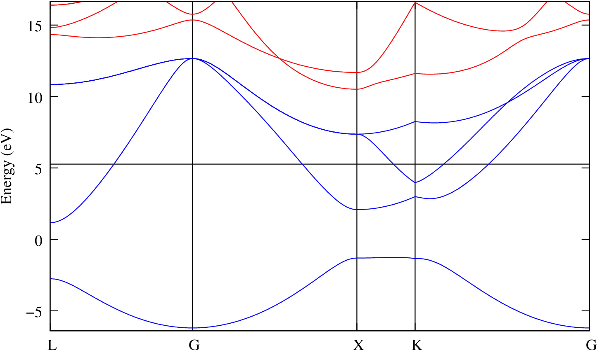

# 2: Lead &#151; Wannier-interpolated Fermi surface

- Outline: *Obtain MLWFs for the four lowest states in lead. Use
    Wannier interpolation to plot the Fermi surface.*

- Generation Details: *From `pwscf`, using norm-conserving
    pseudopotentials and a <br>
    4$\times$4$\times$4 k-point grid.
    Starting guess: atom-centred sp$^3$ hybrid orbitals*

- Directory: `tutorials/tutorial02/` *Files can be downloaded from [here](https://github.com/wannier-developers/wannier90/tree/develop/tutorials/tutorial02)*

- Input Files

    - `lead.win` *The master input file*

    - `lead.mmn` *The overlap matrices
        $\mathbf{M}^{(\mathbf{k},\mathbf{b})}$*

    - `lead.amn` *Projection $\mathbf{A}^{(\mathbf{k})}$ of the Bloch
        states onto a set of trial localised orbitals*

    - `lead.eig` *The Bloch eigenvalues at each k-point. For
        interpolation only*

The four lowest valence bands in lead are separated in energy from the
higher conduction states (see bandstructure [plot](#fig:pb-bnd)). The MLWFs of
these states have partial
occupancy. MLWFs describing only the occupied states would be poorly localised.

1. Run `wannier90` to minimise the MLWFs spread

    ```bash title="Terminal"
    wannier90.x lead
    ```

    Inspect the output file `lead.wout`.

2. Use Wannier interpolation to generate the Fermi surface of lead.
    Rather than re-running the whole calculation we can use the unitary
    transformations obtained in the first calculation and restart from
    the plotting routine. Add the following keywords to the `lead.win`
    file:

    ```vi title="Input file"
    restart = plot
    fermi_energy = 5.2676
    fermi_surface_plot = true
    ```

    and re-run `wannier90`. The value of the Fermi energy (5.2676 eV)
    was obtained from the initial first principles calculation.
    `wannier90` calculates the band energies, through

    interpolation, on a dense mesh of k-points in the Brillouin zone.
    The density of this grid is controlled by the keyword
    `fermi_surface_num_points`. The default value is 50 (i.e., 50$^3$
    points). The Fermi surface file `lead.bxsf` can be viewed using
    `XCrySDen`, e.g.,

    ```bash title="Terminal"
    xcrysden --bxsf lead.bxsf
    ```

<figure markdown="span" id="fig:pb-bnd">
{ width="500" }
<figcaption> Bandstructure of lead showing the position of the Fermi
level. Only the lowest four bands are included in the
calculation.</figcaption>
</figure>
